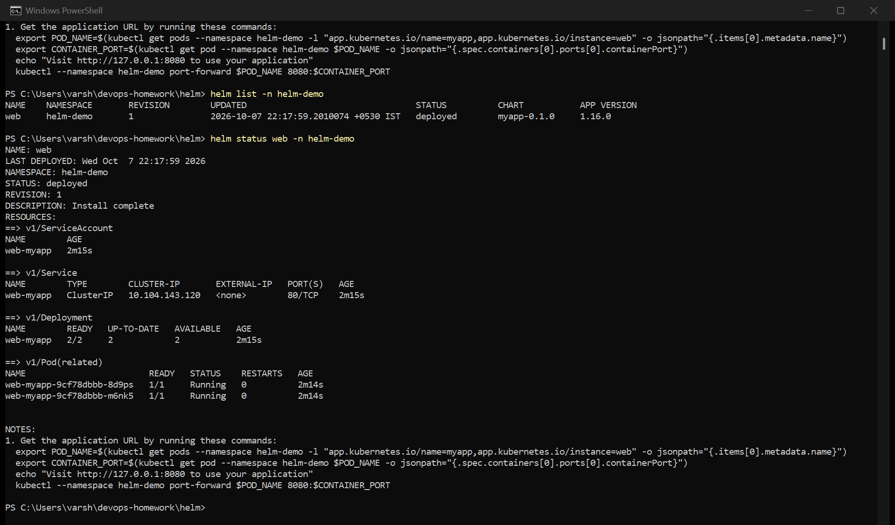
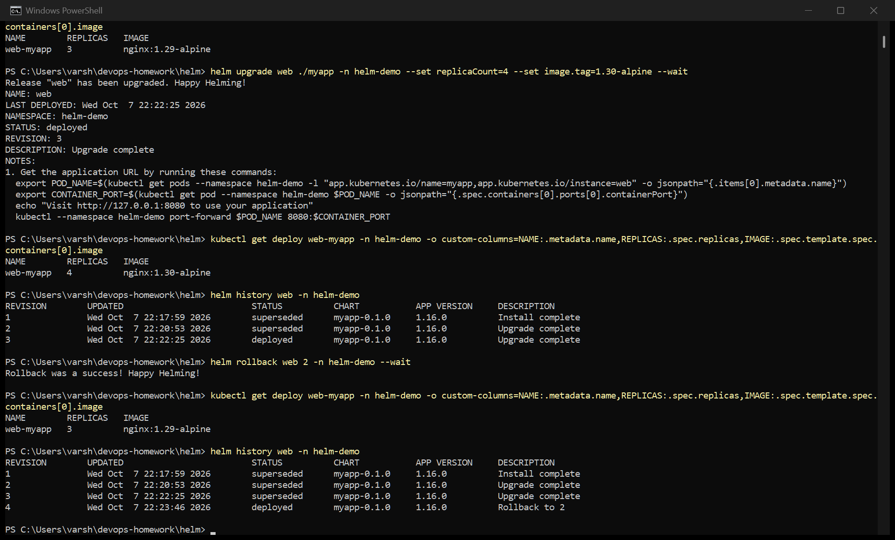
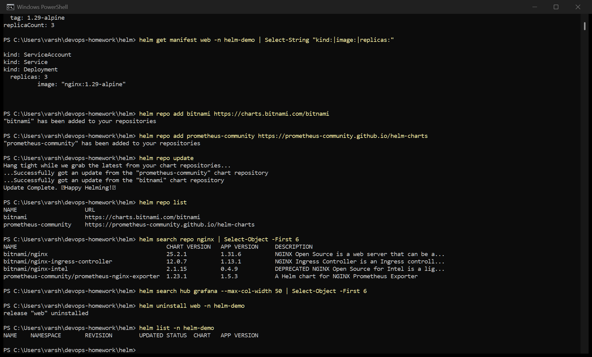
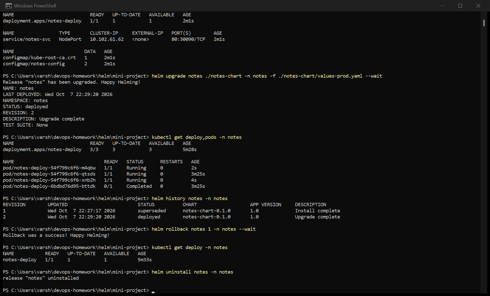

# Session 15 — Helm

Everything here ran on my Minikube cluster with Helm v4.3.0. Screenshots are captures of my
terminal while I ran each step.

- [myapp/](myapp/) — the chart I generated with `helm create` and used for the command practice
- [mini-project/notes-chart/](mini-project/notes-chart/) — the session's Notes app mini project

Helm is a package manager for Kubernetes. A **chart** is a folder of templated YAML plus a
`values.yaml`; `helm install` renders the templates with those values and applies the result as
one **release**. Every install, upgrade or rollback is recorded as a numbered **revision**, which
is what makes rollback possible.

---

## Task 1: Helm commands

### helm create, install, list, status

- `helm create myapp` — scaffolds a chart: `Chart.yaml` (name/version), `values.yaml` (defaults),
  and `templates/` (deployment, service, ingress, hpa, serviceaccount, tests, `_helpers.tpl`).
- `helm install web ./myapp -n helm-demo --create-namespace --set replicaCount=2 --wait` — installs
  the chart as a release called `web`. `--set` overrides a value without editing the file, and
  `--wait` blocks until the pods are actually Ready rather than returning as soon as the YAML is
  accepted.
- `helm list` — releases in the namespace, with revision, status and chart version.
- `helm status` — the state of one release plus the chart's NOTES.

### helm upgrade, history, rollback (Task 2: the rollback workflow)

The doc asks for: Install → Upgrade → Verify → Upgrade again → Verify → Rollback → Verify.

| Step | Command | Verified |
|---|---|---|
| Install (rev 1) | `helm install web ./myapp --set replicaCount=2` | 2 replicas, nginx 1.16.0 |
| Upgrade (rev 2) | `helm upgrade web ./myapp --set replicaCount=3 --set image.tag=1.29-alpine` | 3 replicas, `nginx:1.29-alpine` |
| Upgrade again (rev 3) | `helm upgrade web ./myapp --set replicaCount=4 --set image.tag=1.30-alpine` | 4 replicas, `nginx:1.30-alpine` |
| Rollback (rev 4) | `helm rollback web 2` | back to 3 replicas, `nginx:1.29-alpine` |

The thing worth noticing in `helm history`: the rollback did **not** delete revision 3 or go back
to being revision 2. It created a **new revision 4** whose content is a copy of revision 2, with
the description `Rollback to 2`. History only ever grows, so you can always see exactly what
happened and even roll "forward" again to revision 3.

Each upgrade only has the `--set` values I passed that time, which is why rev 3 doesn't carry
over rev 2's settings unless I set them again (or use `--reuse-values`).

### helm get, repo, search, uninstall

- `helm get values web` — the values the current revision was installed with (after the rollback,
  rev 2's values).
- `helm get manifest web` — the fully rendered YAML Helm actually applied. This is the command I'd
  use to debug a template, because it shows what Kubernetes received.
- `helm repo add` / `helm repo update` / `helm repo list` — register chart repositories (Bitnami
  and prometheus-community) and refresh their indexes, like `apt update`.
- `helm search repo nginx` searches the repos I've added; `helm search hub grafana` searches
  Artifact Hub, the public index of all charts.
- `helm uninstall web` — removes every resource the release created in one go, which is one of
  the biggest wins over plain `kubectl apply`.

| Command | What it does |
|---|---|
| `helm create <name>` | scaffold a new chart |
| `helm install <release> <chart>` | render and deploy a chart as a release |
| `helm list` | list releases |
| `helm status <release>` | status and notes of a release |
| `helm get values/manifest <release>` | values used / YAML applied |
| `helm upgrade <release> <chart>` | deploy a new revision |
| `helm history <release>` | all revisions |
| `helm rollback <release> <rev>` | new revision copying an older one |
| `helm uninstall <release>` | delete everything the release created |
| `helm repo add/update/list` | manage chart repositories |
| `helm search repo/hub <term>` | find charts |

---

## Task 3: Mini project — Notes app chart

The course's `notes-chart` (nginx standing in for a Notes app) with a `values.yaml` for development
and a `values-prod.yaml` for production. The chart has a Deployment, a Service and a ConfigMap
whose values come from `values.yaml`.

| | values.yaml (dev) | values-prod.yaml |
|---|---|---|
| replicas | 1 | 3 |
| image tag | nginx 1.24 | nginx 1.25 |
| environment | development | production |

What I did:

1. `helm lint` — checks the chart for errors before installing
2. `helm install notes ./notes-chart` — deploys the dev configuration: 1 replica
3. `helm upgrade notes ./notes-chart -f values-prod.yaml` — same chart, production values: 3 replicas
   and the newer image. This is the main point of Helm: one chart, different values per environment
4. `helm rollback notes 1` — back to the dev configuration
5. `helm uninstall notes` — clean up

## Deliverables

- Helm chart — [myapp/](myapp/) and [mini-project/notes-chart/](mini-project/notes-chart/)
- values.yaml — `myapp/values.yaml`, `notes-chart/values.yaml`, `notes-chart/values-prod.yaml`
- Templates — `myapp/templates/`, `notes-chart/templates/`
- Installation, upgrade, rollback — screenshots above
