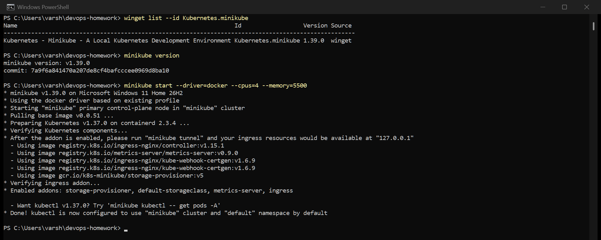
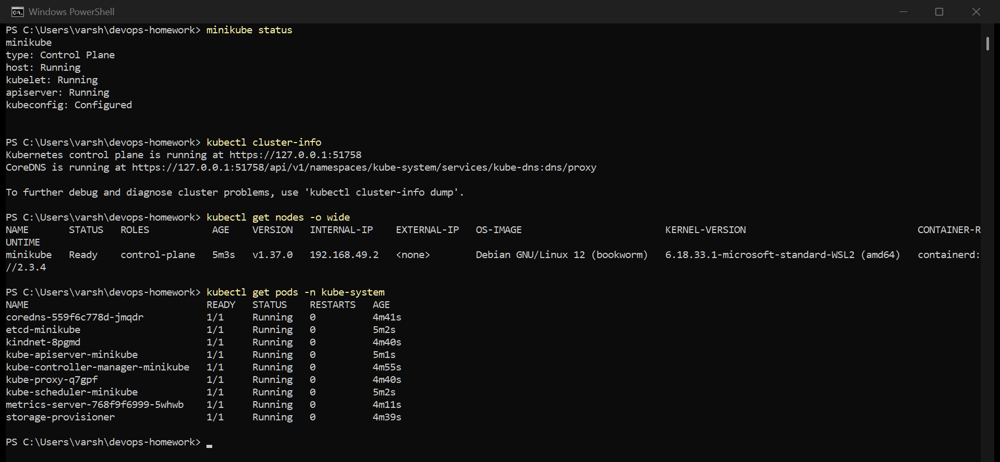
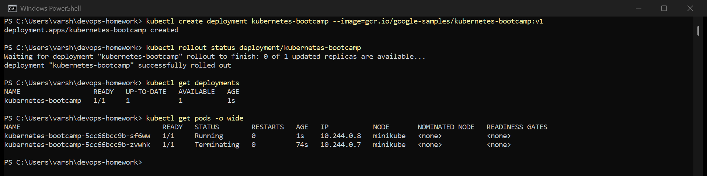
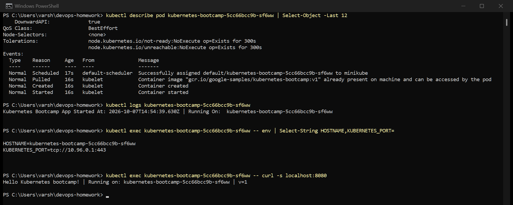
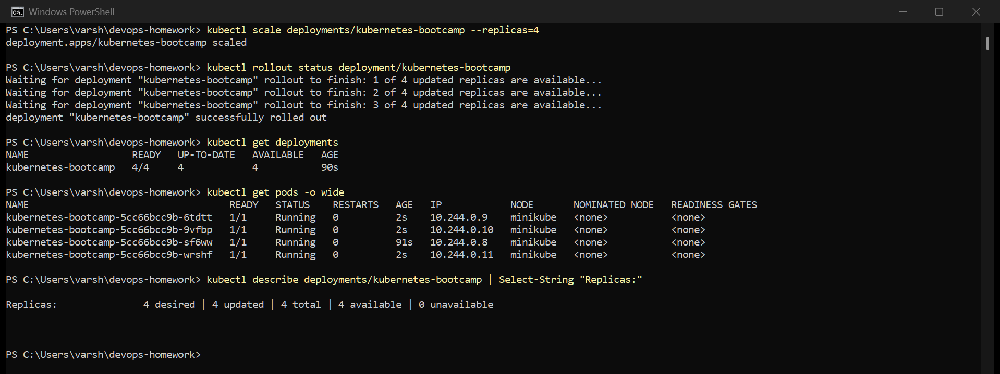
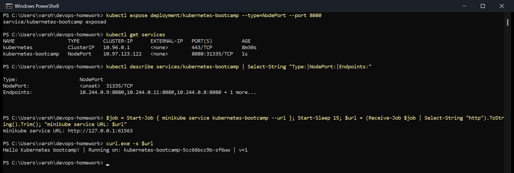
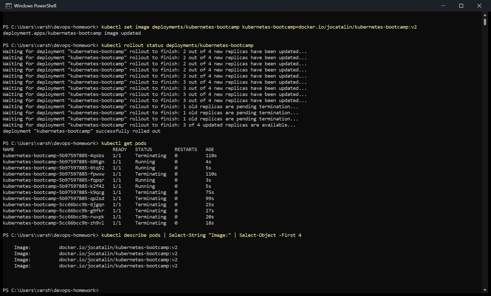
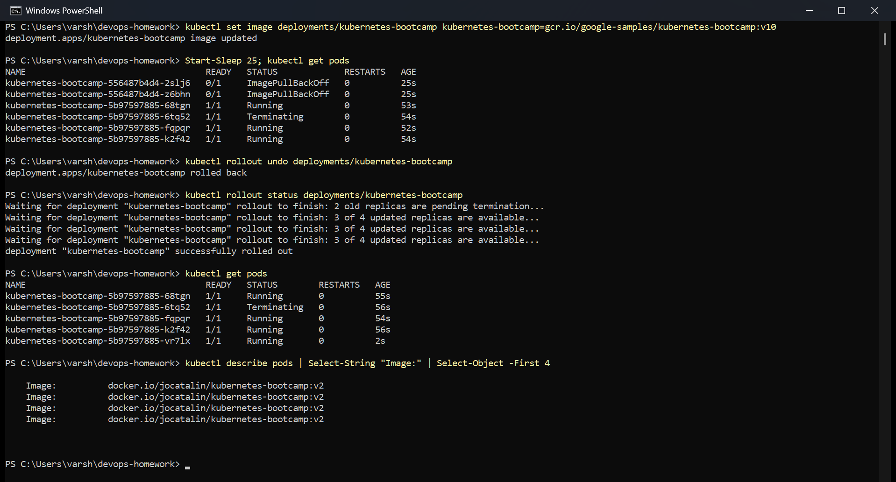

# Session 9 — Kubernetes Fundamentals

What the session asked for:

1. Install and configure Minikube
2. Verify the cluster status
3. Explore the Kubernetes architecture
4. Learn the basic objects and commands
5. Do the Kubernetes Basics tutorial hands-on

All screenshots below are real captures of my terminal, taken while I ran each step.

---

## 1. Installing and configuring Minikube

I'm on Windows 11 with Docker Desktop, so I installed Minikube with winget and used the Docker
driver, which runs the whole node as a container instead of needing a VM:

```powershell
winget install --id Kubernetes.minikube -e
minikube start --driver=docker --cpus=4 --memory=5500
```

I gave it 4 CPUs and about 5.5 GB because the later sessions run Prometheus, Grafana and ArgoCD on
this same cluster, and the defaults are too small for that.



The start output already tells you a lot: it runs Kubernetes v1.37.0 on containerd, and it
enabled the addons I need later — `metrics-server` (for HPA and `kubectl top`) and `ingress`
(the nginx Ingress controller).

## 2. Verifying the cluster



- `minikube status` — host, kubelet and apiserver are all `Running`, and kubeconfig is
  `Configured`, which means `kubectl` is pointed at this cluster.
- `kubectl cluster-info` — the API server is on a localhost port because Minikube publishes it
  out of the node container.
- `kubectl get nodes -o wide` — one node, `Ready`, role `control-plane`, Debian 12 inside the
  container, containerd as the runtime.

A note on my setup: my `kubectl` is v1.34 and the cluster is v1.37. Kubernetes only officially
supports one minor version of skew, so `kubectl version` prints a warning. Everything in these
labs worked, but if I hit odd errors on newer API fields, that would be the first thing to fix.

## 3. Kubernetes architecture

Everything in the `kube-system` namespace in the screenshot above is a piece of the architecture:

| Component | What it does |
|---|---|
| `kube-apiserver` | the front door. `kubectl`, the kubelet and every controller talk to it; nothing else talks to etcd |
| `etcd` | key-value store with the whole cluster state. Lose etcd and you lose the cluster |
| `kube-scheduler` | picks a node for every new pod, based on resources, affinity and taints |
| `kube-controller-manager` | runs the control loops, e.g. "this ReplicaSet wants 3 pods but has 2, make one" |
| `kube-proxy` | programs iptables on each node so Service IPs route to the right pods |
| `coredns` | cluster DNS — the reason a pod can reach `backend` by name |
| `kindnet` | the CNI plugin giving pods their network. Real clusters often use Calico or Cilium here |
| `metrics-server` | collects CPU/memory from kubelets. Needed for `kubectl top` and HPA |
| `storage-provisioner` | creates volumes automatically when a PVC asks for one |

On the worker side, each node runs the **kubelet** (starts and watches containers), the
**container runtime** (containerd here) and **kube-proxy**.

```
                 kubectl
                    |
              kube-apiserver  <---->  etcd
              /     |      \
     scheduler  controller   (kubelets on each node report in)
                 manager
                    |
   node:  kubelet -> containerd -> pods      kube-proxy -> iptables
```

In Minikube there is only one node, so the control plane and the worker are the same machine.
On a real cluster they are separate machines, and you would have several workers.

The idea that made this click for me: `kubectl` does not start containers. It writes the desired
state to the API server, which stores it in etcd. The scheduler then notices an unscheduled pod
and assigns a node, and that node's kubelet notices a pod assigned to it and starts it. Each piece
just watches the API server and reacts.

## 4 and 5. The Kubernetes Basics tutorial

I followed the official tutorial modules in order.

### Deploy an app

```powershell
kubectl create deployment kubernetes-bootcamp --image=gcr.io/google-samples/kubernetes-bootcamp:v1
```



One command created a Deployment, which created a ReplicaSet, which created a pod. The pod got
an IP from the pod network and was scheduled onto the `minikube` node.

### Explore the app



- `describe pod` — the Events at the bottom show the whole startup: scheduled, image pulled,
  container created, started. This is the first place I would look if a pod were broken.
- `logs` — the app's own output, which includes the pod name it is running on.
- `exec ... env` — the pod's hostname is its pod name, and Kubernetes injects `KUBERNETES_PORT`
  so apps can find the API server.
- `exec ... curl localhost:8080` — I can reach the app from inside its own container, which proves
  the app is serving before any Service is involved.

### Scale the app

```powershell
kubectl scale deployments/kubernetes-bootcamp --replicas=4
```



Four pods, each with its own IP. The Deployment's desired replicas changed and the ReplicaSet
created three more.

### Expose the app

```powershell
kubectl expose deployment/kubernetes-bootcamp --type=NodePort --port 8080
```



The Service got a ClusterIP and a NodePort (`31335`), and its Endpoints list all four pod IPs.

The tutorial uses `curl $(minikube ip):$NODE_PORT`. That does not work on Windows with the Docker
driver, because the node's IP (`192.168.49.2`) is inside Docker's network and not reachable from
Windows. `minikube service --url` is the documented workaround: it opens a tunnel and prints a
`127.0.0.1` URL. That command has to keep running to hold the tunnel open, so I ran it as a
background job and then curled the URL it printed.

### Update the app (rolling update)

```powershell
kubectl set image deployments/kubernetes-bootcamp kubernetes-bootcamp=docker.io/jocatalin/kubernetes-bootcamp:v2
```



`rollout status` shows it replacing pods a few at a time ("2 out of 4 new replicas have been
updated..."), so some pods were always serving. The old pods show as `Terminating` with the old
ReplicaSet hash, and the new ones carry a new hash. Afterwards every pod runs the `v2` image.

### Bad update and rollback

The last module deliberately deploys a tag that doesn't exist:



Two new pods went into `ImagePullBackOff` because `kubernetes-bootcamp:v10` doesn't exist. The
important bit is that the rollout **stopped there**: the four v2 pods kept running, so the app
never went down. A rolling update never removes the last working pods while the new ones can't
become ready.

`kubectl rollout undo` went back to the previous revision. The broken pods were removed, and all
pods are back on `v2`.

---

## Commands used

```bash
# install / cluster
winget install --id Kubernetes.minikube -e
minikube start --driver=docker --cpus=4 --memory=5500
minikube status
minikube addons enable metrics-server
minikube addons enable ingress
kubectl cluster-info
kubectl get nodes -o wide
kubectl get pods -n kube-system

# tutorial
kubectl create deployment kubernetes-bootcamp --image=gcr.io/google-samples/kubernetes-bootcamp:v1
kubectl get deployments
kubectl get pods -o wide
kubectl describe pod <pod>
kubectl logs <pod>
kubectl exec <pod> -- env
kubectl exec <pod> -- curl -s localhost:8080
kubectl scale deployments/kubernetes-bootcamp --replicas=4
kubectl expose deployment/kubernetes-bootcamp --type=NodePort --port 8080
kubectl get services
minikube service kubernetes-bootcamp --url
kubectl set image deployments/kubernetes-bootcamp kubernetes-bootcamp=docker.io/jocatalin/kubernetes-bootcamp:v2
kubectl rollout status deployments/kubernetes-bootcamp
kubectl rollout undo deployments/kubernetes-bootcamp
```
