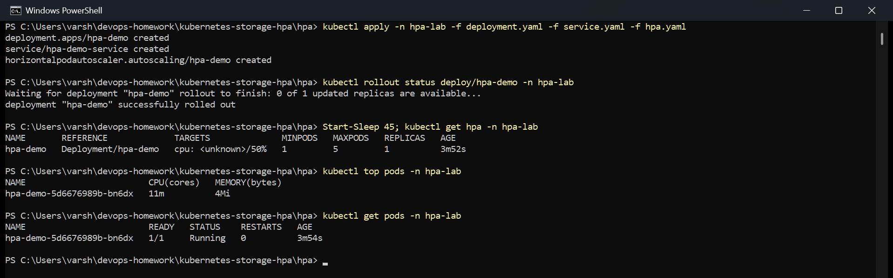
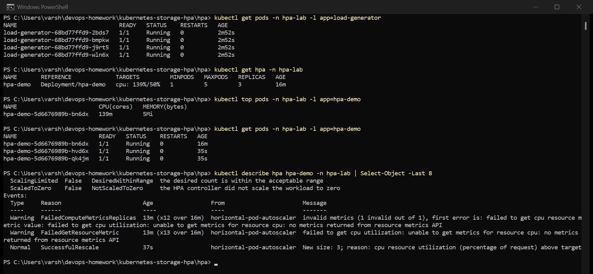
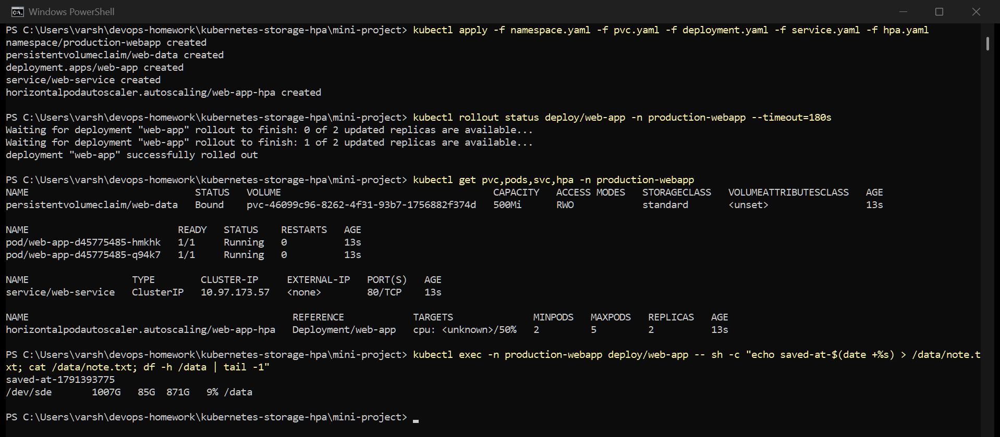

# Session 13 — Kubernetes Storage, HPA and Probes

Run on my Minikube cluster (metrics-server addon enabled). Screenshots are real captures of my
terminal.

- [01-kubernetes-volumes/](01-kubernetes-volumes/) — Task 1, volume documentation
- [hpa/](hpa/) — Task 2, HPA manifests and load generator
- [mini-project/](mini-project/) — Task 3

---

## Task 2: HPA hands-on

Files in [hpa/](hpa/): the course's `deployment.yaml`, `service.yaml` and `hpa.yaml`, plus my
`load-generator.yaml`.

The HPA targets 50% CPU, with 1 to 5 replicas. The percentage is relative to the pod's CPU
**request** (100m), so 50% means about 50 millicores per pod. Without a CPU request the HPA can't
compute a percentage at all.

### 1–3. Deploy, configure and verify the HPA

```
kubectl apply -n hpa-lab -f deployment.yaml -f service.yaml -f hpa.yaml
kubectl get hpa -n hpa-lab
kubectl top pods -n hpa-lab
```



With no traffic the HPA sat at 1 replica and `0%/50%`.

### 4–5. Load generator and increased load

[load-generator.yaml](hpa/load-generator.yaml) runs 4 busybox pods, each calling
`hpa-demo-service` in a tight `wget` loop. One generator wasn't enough to push a static nginx past
50% of 100m, so I used four.

### 6–8. CPU utilization, pod scaling, output



- `kubectl top pods` — the nginx pod went to **139m**, against a 100m request
- `kubectl get hpa` — `cpu: 139%/50%`, **3 replicas**
- `kubectl get pods` — two new `hpa-demo` pods, 35s old next to the original 16m one
- `kubectl describe hpa` — the event `New size: 3; reason: cpu resource utilization (percentage of
  request) above target`

The HPA's maths: desired = ceil(current replicas × current% / target%) = ceil(1 × 139 / 50) = 3.

The `FailedGetResourceMetric` warnings in that same output are from the first 13 minutes, when my
load generator hadn't actually started and metrics-server had no samples yet. I've left them in
because they show what the HPA does when it has no data: it warns and keeps the current replica
count, rather than guessing.

Scale-down is deliberately slow. After the load stops, the HPA waits for a 5-minute stabilization
window before removing pods, so a short dip in traffic doesn't cause flapping.

---

## Task 3: Mini project

The course's production web app in its own namespace: a 500Mi PVC mounted at `/data`, a 2-replica
Deployment with startup, readiness and liveness probes, a Service, and an HPA (2–5 replicas at 50%
CPU).



The deployment uses `strategy: Recreate`, and that's not arbitrary: the PVC is `ReadWriteOnce`,
which means only one node can mount it at a time. A rolling update could try to start the new pod
before the old one releases the volume. On a single-node Minikube cluster both replicas share the
node, so this doesn't bite here, but it would on a multi-node cluster.

The three probes do different jobs:

| Probe | Here | Failing means |
|---|---|---|
| startupProbe | up to 30 × 2s = 60s to start | liveness and readiness are held off until it passes |
| readinessProbe | `GET /` every 5s | pod removed from the Service until it recovers |
| livenessProbe | `GET /` every 5s, 3 failures | container is restarted |

---

## Commands used

```bash
kubectl apply -f <file>
kubectl get hpa
kubectl describe hpa hpa-demo
kubectl top pods
kubectl get pods
kubectl get pvc
kubectl rollout status deploy/<name>
```
