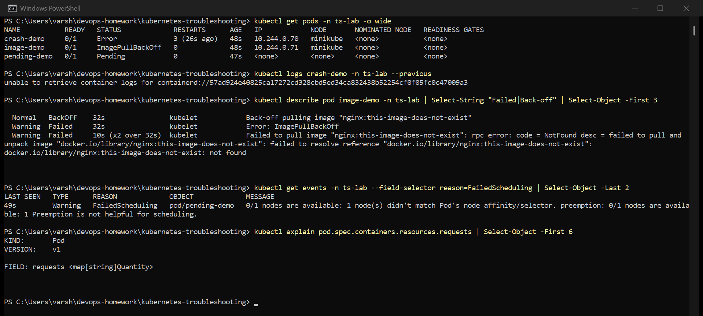
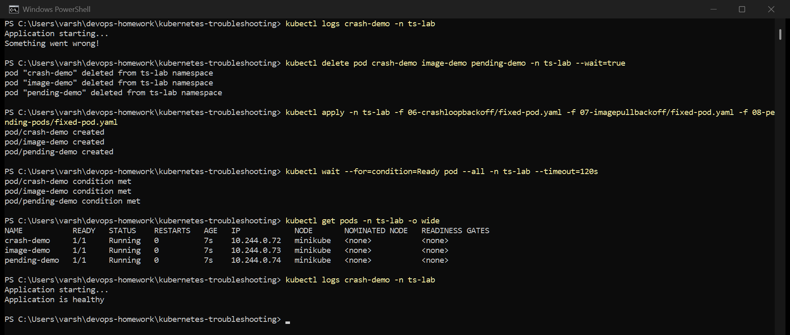

# Session 14 — Kubernetes Troubleshooting

The course's broken/fixed manifests, run on my Minikube cluster in a `ts-lab` namespace. The
manifests are in the numbered folders. Screenshots are real captures of my terminal.

The approach is the same for every issue: **identify** the symptom with `get`, **investigate**
with `describe`, `logs` and `events`, find the **root cause**, **fix** the manifest, and **verify**.

---

## Before: three broken pods

`kubectl get pods -o wide` shows three different failures at once, and the columns already split
them into two kinds:

- `crash-demo` and `image-demo` **have an IP and a node**, so they were scheduled. The problem is
  on the node, either in the image or in the container.
- `pending-demo` has **no IP and no node** (`<none>`). It was never scheduled, so the problem is in
  the scheduling rules, and its logs will be empty because no container ever ran.

### 1. CrashLoopBackOff — `crash-demo`

| Step | What I did / saw |
|---|---|
| Identify | `Error`, 3 restarts in 48s |
| Investigate | `kubectl logs crash-demo` → `Application starting...` then `Something went wrong!` |
| Root cause | the container's command ends in `exit 1`, so it exits immediately; restartPolicy `Always` restarts it, and the restarts back off |
| Fix | [fixed-pod.yaml](06-crashloopbackoff/fixed-pod.yaml) — the command keeps running (`sleep 3600`) instead of exiting with an error |
| Verify | `Running`, 0 restarts, logs show `Application is healthy` |

One honest note: `kubectl logs --previous` returned "unable to retrieve container logs" because the
previous container had already been cleaned up between restarts. The current container's logs
showed the same failure, since every run crashes the same way.

### 2. ImagePullBackOff / ErrImagePull — `image-demo`

| Step | What I did / saw |
|---|---|
| Identify | `ImagePullBackOff`, 0 restarts — the container never started |
| Investigate | `kubectl describe pod` events: `failed to resolve reference "docker.io/library/nginx:this-image-does-not-exist": not found` |
| Root cause | the image tag doesn't exist on Docker Hub. `ErrImagePull` is the first failure; `ImagePullBackOff` is the kubelet waiting longer between retries |
| Fix | [fixed-pod.yaml](07-imagepullbackoff/fixed-pod.yaml) uses a real tag, `nginx:1.27` |
| Verify | `Running` |

Other causes with the same symptom: a typo in the registry name, a private registry without an
`imagePullSecret`, or Docker Hub rate limiting.

### 3. Pending — `pending-demo`

| Step | What I did / saw |
|---|---|
| Identify | `Pending`, no node, no IP |
| Investigate | `kubectl get events --field-selector reason=FailedScheduling` → `0/1 nodes are available: 1 node(s) didn't match Pod's node affinity/selector` |
| Root cause | `nodeSelector: kubernetes.io/hostname: node-that-does-not-exist` — no node has that label |
| Fix | [fixed-pod.yaml](08-pending-pods/fixed-pod.yaml) removes the nodeSelector |
| Verify | scheduled on `minikube`, `Running` |

I expected this one to be a resource problem, because that's the usual cause of Pending (in
session 10 a pod asking for 9Gi stayed Pending with `Insufficient memory`). The events showed it
was a selector mismatch instead, which is why reading the event matters more than guessing.

I also used `kubectl explain pod.spec.containers.resources.requests` to check the field docs
straight from the API server, which is handy when you're not sure what a field accepts.

## After: all three fixed

All three `Running` with 0 restarts, each scheduled on `minikube` with an IP, and `crash-demo`'s logs
now say `Application is healthy`.

---

## Other issues on the list

These came up for real in my other sessions, with the investigation documented there:

| Issue | Where |
|---|---|
| ContainerCreating — not captured as its own case; a pod stuck here is usually still pulling a large image or waiting for a volume to mount, and `kubectl describe pod` events show which | — |
| Service connectivity — endpoints and selectors | [session 11 ClusterIP](../kubernetes-services/clusterip.md) |
| DNS — names only resolve within a shared network or namespace | [session 11 headless/ExternalName](../kubernetes-services/headless.md) |
| Configuration — Ingress controller stuck Pending on a missing node label | [session 12](../kubernetes-config-ingress/README.md) |

The manifests for the service/DNS lab are also copied in [09-service-dns-troubleshooting/](09-service-dns-troubleshooting/).

## Troubleshooting commands

| Command | Use |
|---|---|
| `kubectl get pods -o wide` | first look: status, restarts, node, IP |
| `kubectl describe pod <pod>` | events at the bottom explain most failures |
| `kubectl logs <pod>` / `--previous` | why the app itself failed |
| `kubectl exec -it <pod> -- sh` | look around inside a running container |
| `kubectl get events --sort-by=.lastTimestamp` | everything that happened in the namespace, in order |
| `kubectl explain <resource.field>` | built-in docs for any field |
| `kubectl top pods` / `top nodes` | CPU and memory use (needs metrics-server) |
| `kubectl get endpoints <svc>` | does the Service actually have pods behind it |
