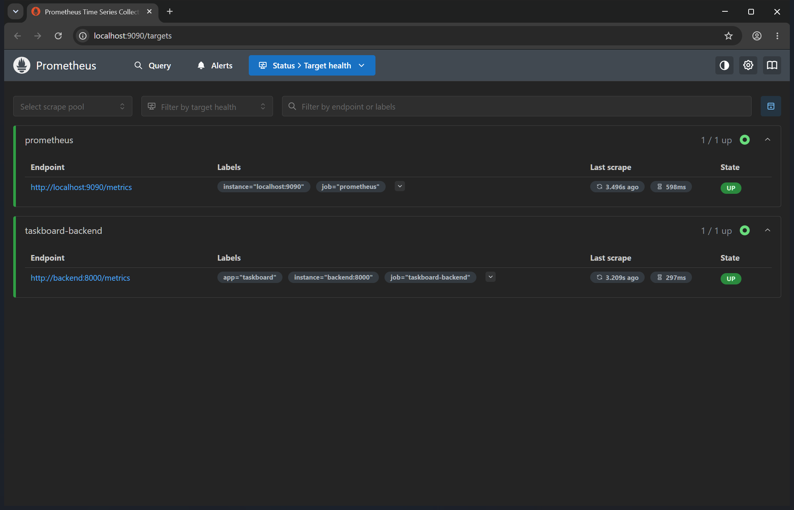
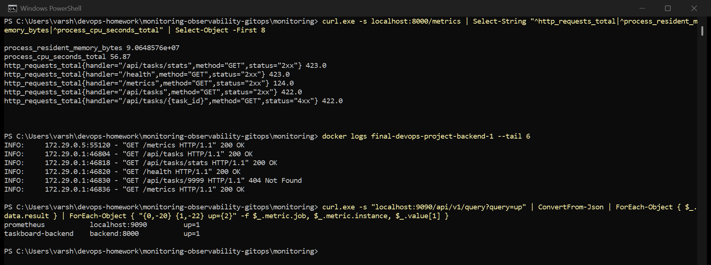
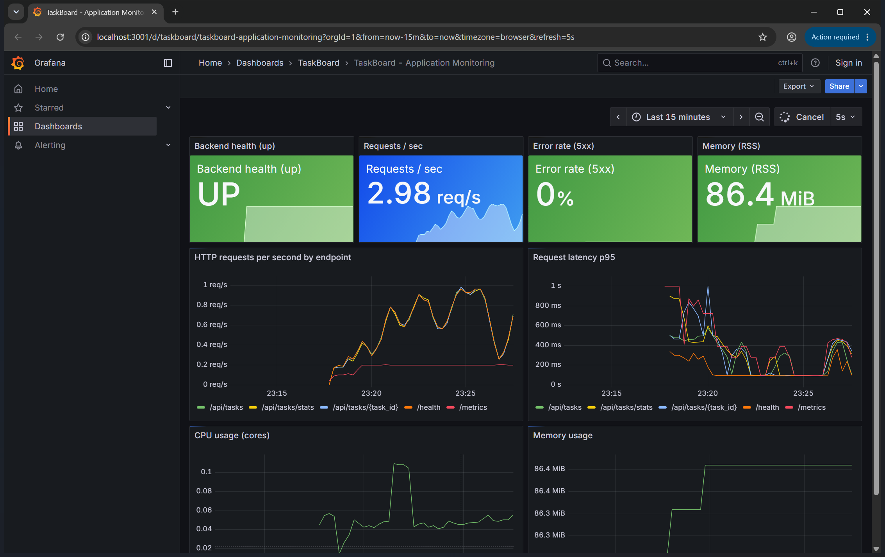
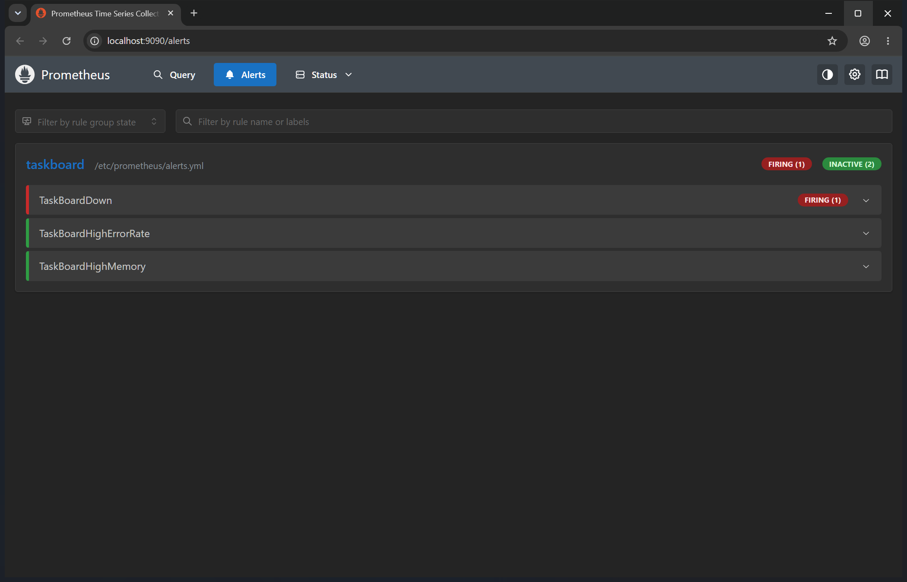

# Session 20 — Monitoring, Observability and GitOps

## Task 1: Monitoring demo

Prometheus and Grafana (the course's versions, run with Docker Compose) monitoring a real app:
the TaskBoard FastAPI backend, which exposes Prometheus metrics at `/metrics`. Everything is in
[monitoring/](monitoring/):

- [prometheus.yml](monitoring/prometheus.yml) — scrapes Prometheus itself and the TaskBoard backend every 5s
- [alerts.yml](monitoring/alerts.yml) — alert rules: backend down, error rate above 5%, memory above 300MB
- [grafana/](monitoring/grafana/) — the datasource and dashboard are provisioned from files, so nothing is set up by hand

```bash
cd monitoring
docker compose up -d      # Prometheus on :9090, Grafana on :3001
```

Prometheus joins the TaskBoard app's Docker network and scrapes the backend by service name
(`backend:8000`). My first attempt used `host.docker.internal`, which pointed at Docker Desktop's
VM rather than Windows, so the target showed as down.

### Targets — both UP



### Metrics and logs



- **Metrics:** `http_requests_total` per endpoint and status, plus `process_cpu_seconds_total` and
  `process_resident_memory_bytes`, straight from `/metrics`
- **Logs:** `docker logs` on the backend shows each request line, which is the event-level detail
  that metrics deliberately throw away
- **Health:** Prometheus's `up` metric is 1 for every target it can scrape

### Grafana dashboard — CPU, memory, application health



| Panel | Query |
|---|---|
| Backend health | `max(up{job="taskboard-backend"})` |
| Requests / sec | `sum(rate(http_requests_total[1m]))` |
| Error rate | 5xx rate ÷ total rate, `or vector(0)` so a clean app shows 0% instead of "No data" |
| Memory | `process_resident_memory_bytes` |
| Requests by endpoint | `sum by (handler) (rate(http_requests_total[1m]))` |
| Latency p95 | `histogram_quantile(0.95, ...)` on the request duration histogram |
| CPU | `rate(process_cpu_seconds_total[1m])` |

The traffic is real: a loop calling the API, including a deliberate `/api/tasks/9999` (404).

### Alerts — a real one firing

I stopped the backend container to trigger `TaskBoardDown`:

```
backend stopped at 23:28:20
t+3s   TaskBoardDown=none
t+15s  TaskBoardDown=pending
t+27s  TaskBoardDown=firing
```



It goes **pending** as soon as the scrape fails, and only **fires** after the condition has held for
the rule's `for: 15s`. That delay is what stops a single missed scrape from paging someone. I then
started the backend again and the alert cleared.

---

## Task 2: Observability

**Monitoring** tells you *that* something is wrong, using things you decided to watch in advance.
**Observability** is being able to work out *why*, including for problems you didn't predict, from
what the system emits.

| Pillar | What it is | Example from above | Tools |
|---|---|---|---|
| **Metrics** | numbers over time, cheap to store and graph | requests/sec, CPU, memory, `up` | Prometheus, Grafana |
| **Logs** | timestamped records of individual events | each request line in `docker logs` | Loki, ELK/EFK, CloudWatch |
| **Traces** | one request's path through every service, with timings | not set up here | Jaeger, Tempo, Zipkin, OpenTelemetry |

How they work together: a metric shows latency spiking, logs show which requests failed and with
what error, and a trace shows which downstream call made them slow.

**Why it's needed:** with many pods and services, a failure rarely sits where it shows up. You
can't SSH into a pod that has already been replaced.

**In Kubernetes:** metrics-server (for `kubectl top` and HPA), kube-prometheus-stack (Prometheus +
Grafana + Alertmanager + node and kube-state exporters), Fluent Bit or Promtail shipping container
logs, and OpenTelemetry for traces. `kubectl get events` is a fourth signal unique to Kubernetes.

---

## Task 3: GitOps

**What it is:** Git is the single source of truth for what should run in the cluster. A controller
in the cluster keeps comparing Git with what's actually running, and fixes any difference.

- **Git as the source of truth** — the YAML in the repo *is* the desired state. Changes go through
  commits and pull requests, so there's history, review and an easy revert.
- **Declarative configuration** — you describe the end state ("3 replicas of this image"), not the
  steps to get there.
- **Continuous reconciliation** — the controller loops forever. If someone runs `kubectl edit` by
  hand, it gets put back to match Git.
- **Workflow** — change YAML → commit → push → Argo CD notices → syncs the cluster. CI pushes to Git;
  it never runs `kubectl` against production.

```
Developer --commit--> Git repo --watched by--> Argo CD (in cluster) --applies--> Kubernetes
                         ^                                                          |
                         +------------- drift is detected and reverted -------------+
```

Push-based CD (my session 16/17 pipelines running `kubectl apply`) needs cluster credentials stored
in CI. Pull-based GitOps keeps those credentials inside the cluster.

### Status of the GitOps demo

Argo CD is installed on my Minikube cluster (all 7 components running in the `argocd` namespace).
**The sync demo itself is not finished yet**: the Application pointing at a folder in this repo,
then a commit showing Argo CD applying it automatically. That needs the manifests pushed to GitHub
first, because Argo CD pulls from Git. I'm adding it next.
