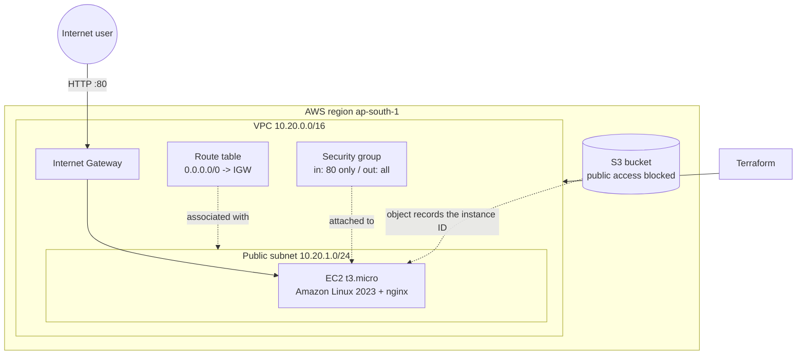
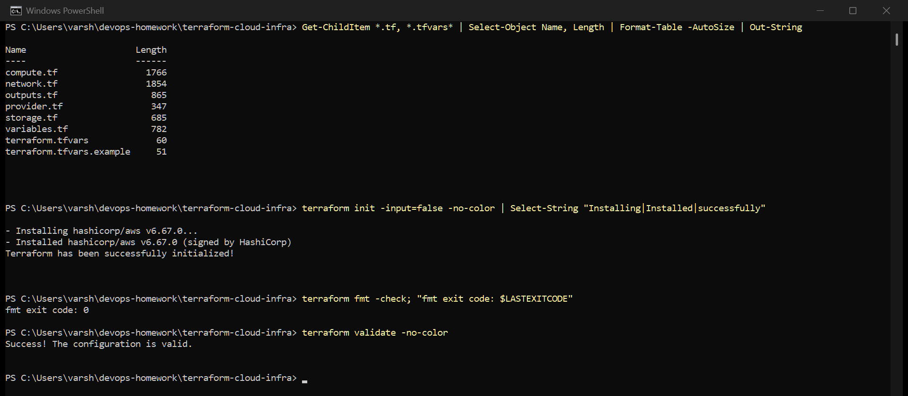
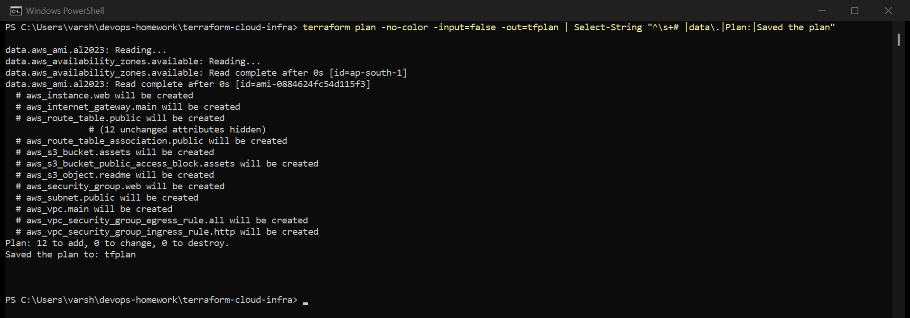
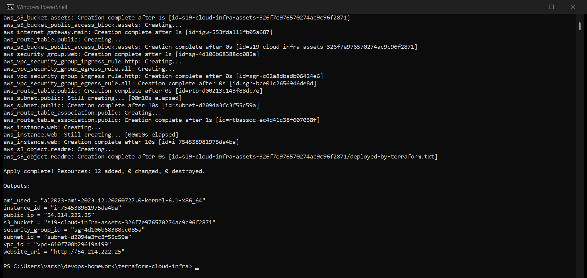
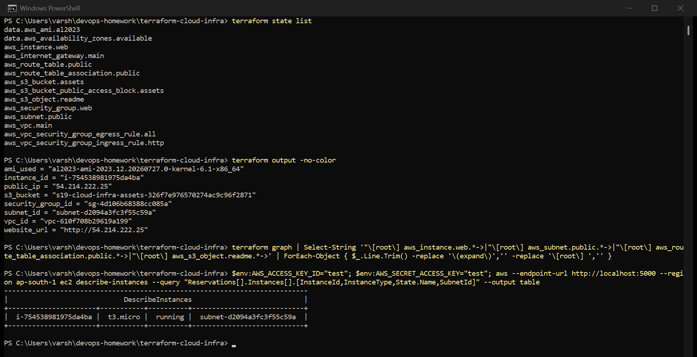
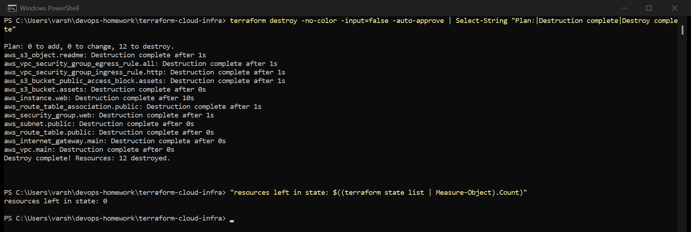

# Session 19 — Cloud and Terraform in Action

An end-to-end infrastructure project with Terraform: a VPC with a public subnet, internet gateway,
route table and security group, an EC2 instance set up to serve a web page, and an S3 bucket.

## Important: where this ran

Same as session 18 — I don't have an AWS account, so this ran against
**[Moto](https://github.com/getmoto/moto)**, an open-source AWS emulator in Docker:

```bash
docker run -d --name moto -p 5000:5000 motoserver/moto:latest
```

[moto_override.tf](moto_override.tf) points the provider at it. **Delete that file and the same
code deploys to real AWS** in `ap-south-1`.

Every Terraform command, the plan, dependency order, state and outputs are real. What Moto can't
do is run an actual virtual machine: it records the EC2 instance and gives it a made-up public IP
(`54.214.222.25`), but nothing boots, so the `user_data` script never runs and the website URL
doesn't load. On real AWS it would serve the page about a minute after `apply`.

---

## Architecture



No NAT gateway and only a public subnet, on purpose: a NAT gateway is charged by the hour even when
idle, and `t3.micro`, a small gp3 disk and S3 are all within the free tier.

## Project structure

```
terraform-cloud-infra/
├── provider.tf              versions, provider, default tags
├── variables.tf             region, CIDRs, instance type, owner
├── network.tf               VPC, subnet, IGW, route table + association, security group + rules
├── compute.tf               AMI lookup, EC2 instance with user_data
├── storage.tf               S3 bucket, public access block, an object
├── outputs.tf               IDs, public IP, website URL, bucket name
├── terraform.tfvars         my values
├── terraform.tfvars.example template without personal values
└── moto_override.tf         points at the local emulator (delete for real AWS)
```

---

## What the project demonstrates

| Concept | Where |
|---|---|
| **Providers** | `provider.tf` — `hashicorp/aws ~> 6.0`, region from a variable, `default_tags` on everything |
| **Variables** | `variables.tf`, set in `terraform.tfvars` |
| **Resources** | 12 managed resources across network, compute and storage |
| **Data sources** | `aws_ami` finds the latest Amazon Linux 2023 instead of a hard-coded AMI ID (AMI IDs differ per region); `aws_availability_zones` picks an AZ |
| **Outputs** | `outputs.tf` — VPC, subnet, SG, instance ID, AMI, public IP, URL, bucket |
| **Dependencies** | implicit (references) and one explicit `depends_on` — below |
| **State** | `terraform state list` after apply; state empty after destroy |
| **plan / apply / destroy** | screenshots below |

### Dependencies

Most dependencies are **implicit**: the subnet uses `aws_vpc.main.id`, the instance uses
`aws_subnet.public.id` and `aws_security_group.web.id`, and the S3 object's content includes
`aws_instance.web.id`. Terraform reads these references and orders everything automatically.

One is **explicit**. The instance's `user_data` runs `dnf install nginx` on first boot, which needs
the route to the internet gateway to already exist. Nothing in the instance references the route
table, so Terraform has no way of knowing that. `depends_on = [aws_route_table_association.public]`
tells it.

The apply output shows both kinds working (screenshot 3):

1. VPC → subnet, internet gateway, security group, S3 bucket (in parallel)
2. route table → route table association
3. **then** the EC2 instance, only after the association — the explicit `depends_on`
4. **then** the S3 object, only after the instance — because its content uses the instance ID

`destroy` runs the same graph backwards: the S3 object first, the VPC last.

---

## The workflow

### init, fmt, validate



### plan



The plan lists both data sources being read and the resources to create, saved with `-out=tfplan`.

### apply



`Apply complete! Resources: 12 added, 0 changed, 0 destroyed.` The AMI lookup resolved to
`al2023-ami-2023.12.20260727.0-kernel-6.1-x86_64`.

### state, output, and checking the result



- `terraform state list` — 2 data sources and 12 resources in state
- `terraform output` — every output
- `aws ec2 describe-instances` — asking the (emulated) EC2 API directly, outside Terraform: the
  instance is a `t3.micro`, `running`, in the subnet Terraform created

### destroy



`Destroy complete! Resources: 12 destroyed.` State is empty afterwards. On real AWS this is the step
that matters most: forgetting it is how student accounts end up with a bill.

---

## Security choices

- **No SSH port** in the security group. Only port 80 is open; on real AWS I'd use SSM Session
  Manager for shell access.
- **IMDSv2 required** (`http_tokens = "required"`), which blocks a class of SSRF attacks that steal
  instance credentials through the metadata service.
- **Encrypted root volume** (gp3).
- **S3 public access fully blocked.**
- Ingress and egress rules are separate `aws_vpc_security_group_*_rule` resources rather than inline
  blocks, which is the current recommended pattern.

## Commands

```bash
terraform init
terraform fmt
terraform validate
terraform plan -out=tfplan
terraform apply tfplan
terraform state list
terraform output
terraform destroy
```
