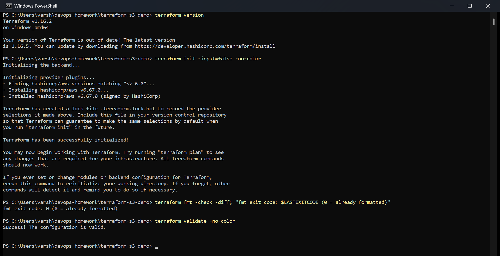
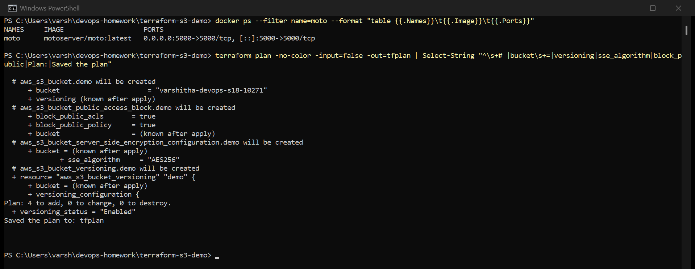
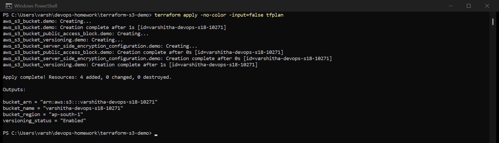
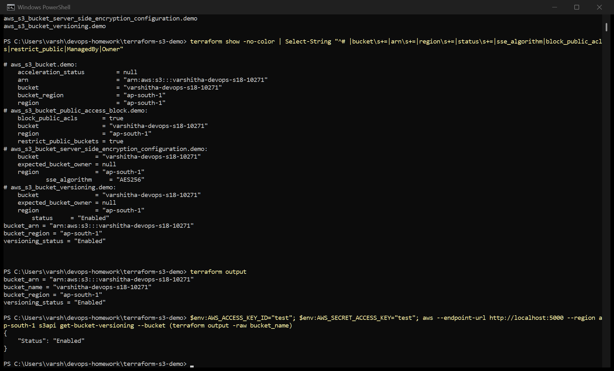
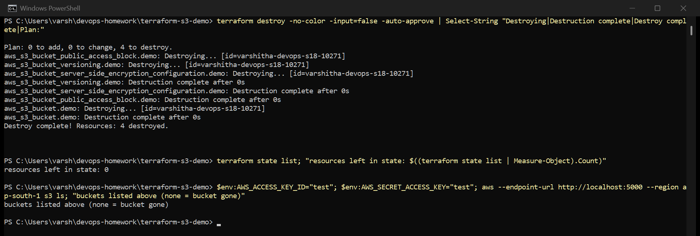

# Session 18 — Terraform and Infrastructure as Code

- **Task 1:** Terraform S3 demo (this folder)
- **Task 2:** AWS services notes — [IAM](../aws-services/01-iam/) · [EC2](../aws-services/02-ec2/) ·
  [S3](../aws-services/03-s3/) · [VPC](../aws-services/04-vpc/) · [DynamoDB & RDS](../aws-services/05-dynamodb-rds/)

## Important: where this ran

I don't have an AWS account, so this ran against **[Moto](https://github.com/getmoto/moto)**, an
open-source AWS emulator running in Docker on my laptop:

```bash
docker run -d --name moto -p 5000:5000 motoserver/moto:latest
```

[moto_override.tf](moto_override.tf) points the AWS provider at `http://localhost:5000`. Terraform
merges any `*_override.tf` file into the configuration automatically. **Delete that one file and
the same code runs against real AWS** — nothing else changes.

The Terraform commands, plan, state and outputs below are all real. The bucket itself was created
inside Moto's emulated S3, not in a real AWS account, which is why the account in the ARN is Moto's.

I tried LocalStack first, but it now requires an account sign-up too, so Moto was the option that
needed no account at all.

---

## Project structure

```
terraform-s3-demo/
├── main.tf             the bucket, versioning, encryption, public access block
├── variables.tf        region, bucket name (with validation), owner, environment
├── outputs.tf          bucket name, ARN, region, versioning status
├── provider.tf         Terraform/provider versions, region, default tags
├── terraform.tfvars    my values
├── moto_override.tf    points at the local emulator (delete for real AWS)
└── README.md
```

## What it creates

Not just a bare bucket — the settings a real bucket should have:

| Resource | Why |
|---|---|
| `aws_s3_bucket` | the bucket, `force_destroy = true` so `terraform destroy` works even if it has objects |
| `aws_s3_bucket_versioning` | keeps old versions, so overwrites and deletes can be undone |
| `aws_s3_bucket_server_side_encryption_configuration` | AES-256 encryption at rest |
| `aws_s3_bucket_public_access_block` | all four Block Public Access settings on |

`provider.tf` adds `default_tags` (Project, Session, ManagedBy, Owner) to every resource, and
`variables.tf` validates the bucket name against S3's naming rules before any API call is made.

The course example hard-coded the bucket name `yatri1107`. S3 bucket names are **globally unique
across every AWS account**, so that name would fail for everyone except whoever created it first.
Mine comes from `terraform.tfvars`: `varshitha-devops-s18-10271`.

---

## The workflow

### terraform init, fmt, validate



- `init` downloads the AWS provider (v6.67.0) and writes `.terraform.lock.hcl`, which pins the exact
  provider version so everyone gets the same one. The lock file is committed.
- `fmt -check` exits 0, so the code is already in canonical format.
- `validate` checks syntax and references without calling AWS.

### terraform plan



`Plan: 4 to add, 0 to change, 0 to destroy.` The plan is saved to a file with `-out=tfplan`, so
`apply` executes exactly what was reviewed and nothing else.

### terraform apply



The bucket is created first. The other three resources reference `aws_s3_bucket.demo.id`, so
Terraform knows they depend on it, waits for it, then creates them in parallel.

### terraform show and terraform output



- `terraform state list` — the 4 resources Terraform is now tracking
- `terraform show` — the real attributes from state: AES256, public access blocked, versioning Enabled
- `terraform output` — the values from `outputs.tf`
- `aws s3api get-bucket-versioning` — a check outside Terraform, asking the (emulated) S3 API
  directly. It agrees: `"Status": "Enabled"`.

### terraform destroy



`Destroy complete! Resources: 4 destroyed.` The order is reversed: the three settings resources go
first and the bucket last, because they depend on it. Afterwards the state is empty and `aws s3 ls`
lists no buckets.

---

## What I took away

- **State is the core of Terraform.** `terraform.tfstate` maps my code to real resource IDs. That's
  how `plan` knows what already exists, and why the state file is never committed (it's in
  `.gitignore`, and it can contain secrets). Teams keep it in S3 with locking.
- **Dependencies come from references.** I never wrote "create the bucket first" — referencing
  `aws_s3_bucket.demo.id` was enough for Terraform to build the order.
- **`plan -out` then `apply <file>`** is the safe way to apply: what you reviewed is exactly what runs.

## Commands

```bash
terraform init
terraform fmt
terraform validate
terraform plan -out=tfplan
terraform apply tfplan
terraform state list
terraform show
terraform output
terraform destroy
```
